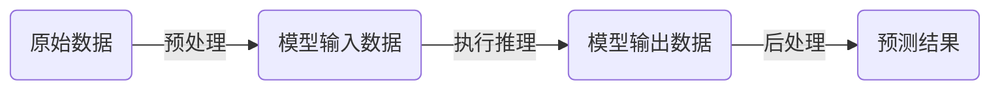
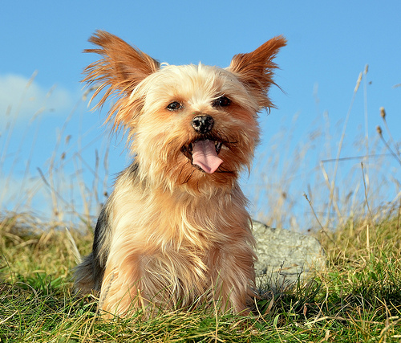

## 端到端流程

### 关键步骤

从原始数据到预测结果，即推理的端到端流程，均包含以下三个关键步骤:

+ 预处理：将原始数据转化为模型可以接受的格式
+ 执行推理：模型获取到输入数据，执行前向推理，返回模型输出
+ 后处理：将模型输出转化可以直观理解的数据



<center><font size="1">图1. 端到端推理流程</font></center>

### 示例

以[ResNet50](https://pytorch.org/vision/stable/_modules/torchvision/models/resnet.html)端模型为例，对图片`ILSVRC2012_val_00006083.jpeg`进行分类。测试图片如下：



测试代码参照[torchvision官方示例](https://pytorch.org/vision/0.15/models.html#classification)：

```python
from torchvision.io import read_image
from torchvision.models import resnet50, ResNet50_Weights

img = read_image("ILSVRC2012_val_00006083.jpeg")

# Step 1: Initialize model with the best available weights
weights = ResNet50_Weights.DEFAULT
model = resnet50(weights=weights)
model.eval()

# Step 2: Initialize the inference transforms
preprocess = weights.transforms()

# Step 3: Apply inference preprocessing transforms
batch = preprocess(img).unsqueeze(0)

# Step 4: Use the model and print the predicted category
prediction = model(batch).squeeze(0).softmax(0)
class_id = prediction.argmax().item()
score = prediction[class_id].item()
category_name = weights.meta["categories"][class_id]
print(f"{category_name}: {100 * score:.1f}%")
```

输出结果：

```
Yorkshire terrier: 29.3%
```

### 抽象化

为方便理解与扩展，这里将上例中的关键步骤进行解耦，并将端到端推理封装为一个类。

```python
from torchvision.io import read_image
from torchvision.models import resnet50, ResNet50_Weights

class PytorchInferencer:
    def __init__(self):
        weights = ResNet50_Weights.DEFAULT
        self.model = resnet50(weights=weights)
        self.model.eval()
        self.transforms = weights.transforms()
        self.categories = weights.meta["categories"]

    def preprocess(self, image_path):
        """预处理"""
        img = read_image(image_path)
        model_input = self.transforms(img).unsqueeze(0)
        return model_input

    def model_inference(self, model_input):
        """执行推理"""
        model_output = self.model(model_input)
        return model_output

    def postprocess(self, model_output):
        """后处理"""
        model_output = model_output.squeeze(0).softmax(0)
        class_id = model_output.argmax().item()
        score = model_output[class_id].item()
        category_name = self.categories[class_id]
        return dict(category=category_name, class_id=class_id, score=score)

    def e2e_inference(self, image_path):
        """端到端推理"""
        model_input = self.preprocess(image_path)
        model_output = self.model_inference(model_input)
        prediction = self.postprocess(model_output)
        return prediction

inferencer = PytorchInferencer()
print(inferencer.e2e_inference("ILSVRC2012_val_00006083.jpeg"))
# {'category': 'Yorkshire terrier', 'score': 0.2925560474395752}
```

## 预处理

### 为什么需要预处理

1. 推理程序无法直接解析图片、音频、视频、文本等原始数据，需要对原始数据进行处理，使之能满足模型输入要求才能执行后续的推理。
2. 模型训练时，会通过数据预处理提高数据质量，当使用训练好的模型进行推理时，自然也需要进行数据预处理。

> GIGO - garbage in, garbage out! (垃圾输入，垃圾输出!)

### 常见数据的预处理

|  数据类型   | 预处理  |
|  ----  | ----  |
| 图像  |    Crop (裁剪) <br> Resize (缩放)<br> Padding (填充) <br>Normalization (标准化) <br>色彩空间转换|
| 音频 | 重采样<br> 特征提取|
| 视频  | 镜头分割 <br> 帧率转换 <br> 分辨率转换 <br> 采帧 <br> 特征提取 |
| 文本  | 文本清洗 <br> 分词 <br> 去停用词 <br> 标准化 <br> 特征提取 |

### 示例

在以上的端到端示例中，原始图片被读入内存后，仅调用一个`self.transforms(img)`接口便完成了预处理，实际上，此接口中包含多个处理步骤，通过pdb找到对应的[源码](https://github.com/pytorch/vision/blob/v0.15.1/torchvision/transforms/_presets.py#L57)：

```python
def forward(self, img: Tensor) -> Tensor:
    img = F.resize(img, self.resize_size, interpolation=self.interpolation, antialias=self.antialias)
    img = F.center_crop(img, self.crop_size)
    if not isinstance(img, Tensor):
        img = F.pil_to_tensor(img)
    img = F.convert_image_dtype(img, torch.float)
    img = F.normalize(img, mean=self.mean, std=self.std)
    return img
```

可以看到，此处首先对图像缩放了尺寸，然后进行了中心裁剪，接着将图像像素值调整到 [0, 1] 的范围，最后进行标准化。

## 执行推理

### 什么是推理

执行推理是整个端到端推理过程中最关键的一步。根据已有的信息，推断出一个结论，即为推理。对于模型来说，推理就是完成训练后，给模型输入一组数据，然后模型经过计算后输出计算结果的过程。依赖于对于PyTorch模型来说，只需简单地调用模型的`forward`接口即可完成一次模型推理：

```python
model_output = model.forward(model_input)
```

一般来说，自定义的模型继承自`torch.nn.Module`类，此类在`__call__`方法中调用了`forward`，所以，推理调用也可以简化为：

```python
model_output = model(model_input)
```

类似于这样，执行推理时依赖于深度学习框架的推理过程，即为**在线推理**。

### 推理注意事项

推理与训练是相对的，对于PyTorch，在执行推理时，还需注意以下两点:

1. 将模型设置为 eval 模式
   
   ```python
   model.eval()
   ```
   
   模型中的某些层，在训练时与推理时的行为是有不一样的，比如 [Dropout](https://pytorch.org/docs/2.0/generated/torch.nn.Dropout.html#torch.nn.Dropout)、[BatchNorm](https://pytorch.org/docs/2.0/generated/torch.nn.BatchNorm1d.html?highlight=batchnorm#torch.nn.BatchNorm1d)，在执行推理前，需执行上面的代码将模型设置为 [eval](https://pytorch.org/docs/2.0/generated/torch.nn.Module.html?highlight=eval#torch.nn.Module.eval) 模式，通过其[源码](https://pytorch.org/docs/2.0/_modules/torch/nn/modules/module.html#Module.eval)也可以看出，上述代码与`self.train(False)`等价。
   
2. 停用梯度计算
   训练时需要计算梯度来更新模型参数，但推理时，模型参数已经固定，此时我们只关心用已固定的参数来计算出推理结果。所以，在推理前，可以执行以下代码来禁用梯度计算上下文管理器。
   
   ```python
   with torch.no_grad():
       model_output = model(model_input)
   ```
   
   此操作不是必须的。不做此操作也不会对模型的推理结果产生影响，但会增加推理所需的内存与耗时会。详情请参考 [torch.no_grad](https://pytorch.org/docs/2.0/generated/torch.no_grad.html?highlight=no_grad#torch.no_grad)。

## 后处理

后处理是整个端到端推理流程的最后一步。通过后处理，可以把模型的模型的输出转化为我们可以直观理解的数据。模型所处理的任务不同，后处理的步骤也不同。
比如对于图像分类任务，只需以下两步即可：

```
step1: 找出socre最高的label
step2: 将label转译成对应的类别名
```

比如上例，其对应的代码如下：

```python
def postprocess(self, model_output):
    """后处理"""
    class_id = model_output.argmax().item()
    score = model_output[class_id].item()
    category_name = self.categories[class_id]
    return dict(category=category_name, score=score)
```

而对于目标检测任务，其后处理步骤就要复杂得多：

```
step1: 根据置信度阈值过滤掉得分低的检测框
step2: 根据NMS阈值过滤掉掉重叠的检测框
step3: 根据预处理时的缩放与padding策略进行反向操作，在原图上还原检测框坐标
step4: 在原图上绘制检测框、类别、score信息
```


