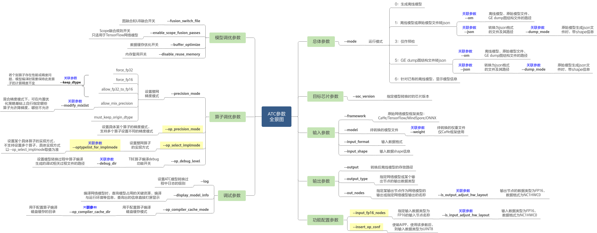

# 常用ONNX转OM

## ATC工具介绍

通过ATC工具可以将开源框架的网络模型（如PyTorch、TensorFlow等）以及Ascend IR定义的单算子描述文件，通过ATC（Ascend Tensor Compiler）将其转换成昇腾AI处理器支持的离线模型，模型转换过程中可以实现算子调度的优化、权值数据重排、内存使用优化等，可以脱离设备完成模型的预处理。

要常使用 `atc -h`,查看具体参数，另外也可以查看[社区文档](https://www.hiascend.com/document/detail/zh/canncommercial/700/inferapplicationdev/atctool/atlasatc_16_0005.html)
如何使用ATC？以下是其参数全景说明：



> **说明：**
> 基础参数：保证ATC能正常运行，使用CANN默认配置进行模型转换
> 高级参数：针对精度/性能/图算融合等场景的个性化配置

## 安装ATC工具

1. 获取安装ATC工具
   参见《[CANN软件安装指南](https://www.hiascend.com/document/detail/zh/CANNCommunityEdition/80RC1alpha001/softwareinst/instg/instg_0001.html)》 进行开发环境搭建，并确保开发套件包Ascend-cann-toolkit安装完成。该场景下ATC工具安装在“ *Ascend-cann-toolkit安装目录* /ascend-toolkit/latest/bin”下。
2. 设置环境变量

    > **须知：**
    > 
    > * 若开发环境架构为Arm（aarch64），模型转换耗时较长，则可以参考[开发环境架构为Arm（aarch64）时模型转换耗时较长](https://www.hiascend.com/document/detail/zh/CANNCommunityEdition/63RC1alpha001/infacldevg/atctool/atlasatc_16_0196.html)解决。
    > * 该工具对Python版本的支持请参见《[CANN软件安装指南](https://www.hiascend.com/document/detail/zh/CANNCommunityEdition/80RC1alpha001/softwareinst/instg/instg_0001.html)》中的“安装开发环境>安装OS依赖>依赖列表”章节，本手册以Python3.10为例进行介绍，相应环境变量和安装命令以实际安装Python版本为准。
    > * 使用ATC工具进行模型转换的过程中，会自动将ATC工具所在位置“../python/site-packages”目录下算子编译依赖的TBE Python库写入PYTHONPATH环境变量。若算子实现时用户引入了TBE模块外的其他Python依赖，请自行添加PYTHONPATH的环境变量，配置引入的Python依赖所在路径，如下所示：
    >   export PYTHONPATH= *xxxx* :$PYTHONPATH

    * 设置公共环境变量
      以root用户安装Ascend-cann-toolkit包
      
      ```shell
      source /usr/local/Ascend/ascend-toolkit/set_env.sh
      #若开发套件包Ascend-cann-toolkit在非昇腾设备上安装，则如下环境变量必须执行，用于设置动态链接库所在路径，否则无需执行
      export LD_LIBRARY_PATH=usr/local/Ascend/ascend-toolkit/latest/<arch>-linux/devlib:$LD_LIBRARY_PATH
      ```
      
      以非root用户安装Ascend-cann-toolkit包
      
      ```shell
      source ${HOME}/Ascend/ascend-toolkit/set_env.sh
      #若开发套件包Ascend-cann-toolkit在非昇腾设备上安装，则如下环境变量必须执行，用于设置动态链接库所在路径，否则无需执行
      export LD_LIBRARY_PATH=${HOME}/Ascend/ascend-toolkit/latest/<arch>-linux/devlib:$LD_LIBRARY_PATH
      ```
    * 设置Python相关环境变量
      模型编译依赖Python，以Python3.10为例，请以CANN软件包运行用户执行如下命令设置Python3.7.5相关环境变量
      
      ```shell
      #如果用户环境存在多个python3版本，则指定使用python3.10版本
      export PATH=/usr/local/python3.10/bin:$PATH
      #设置python3.10库文件路径
      export LD_LIBRARY_PATH=/usr/local/python3.10/lib:$LD_LIBRARY_PATH
      ```

    上述环境变量只在当前窗口生效，用户可以将上述命令写入~/.bashrc文件，使其永久生效，方法如下：

    1. 以安装用户在任意目录下执行vi ~/.bashrc，在该文件最后添加上述内容。

    2. 执行:wq!命令保存文件并退出。

    3. 执行source ~/.bashrc使环境变量生效。

## ONNX转OM模型

以下为常用场景的ATC命令说明，请以ATC工具的对应版本说明为准。

### 静态OM

基本静态OM的流程如下

```shell
atc --framework=5 --model=XXX --output=XXX \
    --input_format=XXX --input_shape=model_input_name:model_input_shape \
    --log=error --soc_version=Ascend${chip_name}
```

   + 参数说明
  
     + framework ： 5代表ONNX模型
     + model ： ONNX模型文件路径与文件名
     + output : 输出的OM模型文件路径与文件名
     + input_format : 可以选NCHW or ND
     + input_shape : 模型输入的shape
     + log : log日志有debug/info/warning/error/null级别
     + soc_version ： 指定模型转换时昇腾AI处理器的版本

特别说明：把log设置成debug，然后配合`export ASCEND_GLOBAL_LOG_LEVEL=0 和 export ASCEND_SLOG_PRINT_TO_STDOUT=1`可以重定向具体日志，方便定位问题

- sample code
  以resnet50的ONNX模型转OM模型为例：

```shell
atc --framework=5 --model=onnx_model/resnet50.onnx --output=om_model_resnet50 \
    --input_format=NCHW --input_shape=input:1,3,256,256 \
    --log=error --soc_version=Ascend310P3
```

---

### 动态OM

#### 动态BatchSize转OM
  
  ```shell
  atc --model=$HOME/module/resnet50.onnx  --framework=5  \
      --output=$HOME/module/out/resnet50 --soc_version=<soc_version> \
      --input_shape="Placeholder:-1,224,224,3"  --dynamic_batch_size="1,2,4,8" \
      --log=error
  ```
  
  + 特定参数说明
    + input_shape : 设置具体的动态轴
    + dynamic_dims : 输入动态轴的具体值
    
#### 动态分辨率转OM
  
  ```shell
  atc --model=$HOME/module/resnet50.onnx  --framework=5 \
      --output=$HOME/module/out/resnet50 --soc_version=<soc_version>  \
      --input_shape="Placeholder:1,-1,-1,3"  --dynamic_image_size="224,224;448,448" \
      --log=error
  ```
  
  + 特定参数说明
    + input_format : 选ND
    + input_shape : 设置具体的动态轴
    + dynamic_dims : 输入动态轴的具体值
    
#### 动态维度转OM
  若网络模型只有一个输入:
  每档中的dim值与--input_shape参数中的-1标识的参数依次对应，--input_shape参数中有几个-1，则每档必须设置几个维度。例如：
  
  ```shell
  atc --model=$HOME/module/resnet50.onnx --framework=5 \
      --output=$HOME/module/out/resnet50 --soc_version=<soc_version>  \
      --input_shape="Placeholder:-1,-1,-1,3" --dynamic_dims="1,224,224;8,448,448" \
      --input_format=ND --log=error
  ```
  
  则ATC在编译模型时，支持的Placeholder算子的shape为1,224,224,3;8,448,448,3。
  
  + 特定参数说明
    + input_format : 选ND
    + input_shape : 设置具体的动态轴
    + dynamic_dims : 输入动态轴的具体值
  
  若网络模型有多个输入：
  每档中的dim值与网络模型输入参数中的-1标识的参数依次对应，网络模型输入参数中有几个-1，则每档必须设置几个维度。例如网络模型有三个输入，分别为data(1,1,40,T)，label(1,T)，mask(T,T) ， 其中T为动态可变。则配置示例为：
  
  ```shell
  atc --framework=5 --model=XXX --output=XXX  --input_format=ND \
      --input_shape="data:1,1,40,-1;label:1,-1;mask:-1,-1" \ 
      --dynamic_dims="20,20,1,1;40,40,2,2;80,60,4,4"  \ 
      --log=error --soc_version=Ascend${chip_name}
  ```
  
  在ATC编译模型时，支持的输入dims组合档数分别为：
  第0档：data(1,1,40,20)+label(1,20)+mask(1,1)
  第1档：data(1,1,40,40)+label(1,40)+mask(2,2)
  第2档：data(1,1,40,80)+label(1,60)+mask(4,4)

  
#### 动态shape转OM
    
    ```shell
    atc --framework=5 --model=XXX --output=XXX --input_format=ND 
        --input_shape="input_0_0:1~10,32,208,208;input_1_0:16,64,100~208,100~208" 
        --log=error --soc_version=Ascend${chip_name}
    ```
   - 特定参数说明
     + input_format : 选ND
     + input_shape : 设置输入的动态范围

特别说明：
1. 建议给具体的范围不要全给-1
2. **关联参数：** 该参数不能与[--dynamic_batch_size](https://www.hiascend.com/document/detail/zh/canncommercial/63RC2/inferapplicationdev/atctool/atctool_000054.html#ZH-CN_TOPIC_0000001606548204)、[--dynamic\_image\_size](https://www.hiascend.com/document/detail/zh/canncommercial/63RC2/inferapplicationdev/atctool/atctool_000055.html#ZH-CN_TOPIC_0000001606388200)、[--dynamic_dims](https://www.hiascend.com/document/detail/zh/canncommercial/63RC2/inferapplicationdev/atctool/atctool_000056.html#ZH-CN_TOPIC_0000001606228428)同时使用。
3. **参数值：** 模型输入数据的shape范围信息，例如："input\_name1:[n1\~n2,c1,h1,w1];input\_name2:[n2,c2,h2,w2]"。指定的节点必须放在双引号中，节点中间使用英文分号分隔。input\_name必须是转换前的网络模型中的节点名称。
4. **参数值约束：** * shape范围信息必须放在英文[]中。* 该参数不限定维度，维度中的任一值都可以由用户指定取值范围。* 如果用户不想指定维度的取值，则可以将其设置为-1，表示此维度可以使用>=1的任意取值。
5. **使用约束：** 该参数只适用于TensorFlow和ONNX网络模型。
6. **使用约束：** 若使用该参数时，同时通过[--insert_op_conf](https://www.hiascend.com/document/detail/zh/canncommercial/63RC2/inferapplicationdev/atctool/atctool_000074.html#ZH-CN_TOPIC_0000001655268481)设置了AIPP功能，则AIPP输出图片的宽和高要在[--input_shape_range](https://www.hiascend.com/document/detail/zh/canncommercial/63RC2/inferapplicationdev/atctool/atctool_000053.html#ZH-CN_TOPIC_0000001606228436)所设置的范围内。
7. **接口约束：** 如果模型转换时通过该参数设置了shape的范围，则使用应用工程进行模型推理时，需要在aclmdlExecute接口之前，调用aclmdlSetDatasetTensorDesc接口，用于设置真实的输入Tensor描述信息（输入shape范围）；模型执行之后，调用aclmdlGetDatasetTensorDesc接口获取模型动态输出的Tensor描述信息；再进一步调用aclTensorDesc下的操作接口获取输出Tensor数据占用的内存大小、Tensor的Format信息、Tensor的维度信息等）。

---

### 特殊参数

- output_type & input_fp16_nodes
  
  - 作用：消除前后cast
  - 说明：前后处理的数据的dtype要做相应处理
- insert_op_conf & enable_small_channel
  
  - 作用：使能[aipp](https://www.hiascend.com/document/detail/zh/CANNCommunityEdition/63RC1alpha001/infacldevg/atctool/atlasatc_16_0015.html)和C04(C轴16对齐降为4对齐，减少搬运和计算)特性
  - 说明: 只对首层卷积有效，aipp只能是uint8输入
- op_select_implmode & optypelist_for_implmode
  
  - 作用：选择算子是否是高性能模式
  - 说明：高性能模式有可能引入精度问题
  - 文件地址：XXX/opp/built-in/op_impl/ai_core/tbe/impl_mode/all_ops_impl_mode.ini
- keep_dtype
  
  - 作用： 在原始网络模型编译时，保持个别算子的计算精度不变。
    
  - 说明： 推理场景下，使用[--precision\_mode](https://www.hiascend.com/document/detail/zh/CANNCommunityEdition/80RC1alpha001/devaids/auxiliarydevtool/aoerc_16_0053.html#ZH-CN_TOPIC_0000001777772364)参数设置整个网络模型的精度模式，可能会有个别算子存在性能或精度问题，为此引入[--keep\_dtype](https://www.hiascend.com/document/detail/zh/CANNCommunityEdition/80RC1alpha001/devaids/auxiliarydevtool/aoerc_16_0061.html#ZH-CN_TOPIC_0000001824332189)参数，保持原始网络模型编译时个别算子的计算精度不变，具体算子可以通过该参数指定的文件进行配置。

- op_debug_level
  
  - 作用：配合`export DUMP_GE_GRAPH=2`可以dump出ge图，方便定位问题
- compression_optimize_conf
  
  - 作用：量化模型
- fusion_switch_file
  
  - 作用： 关闭融合pass
  - 文件地址：XXX/opp/built-in/fusion_pass/config/fusion_config.json


