在完成离线推理后，如果需要获得更好的推理性能，除了使用[ATC特殊参数](03.ONNX转OM.md#特殊参数)，还可以通过自动调优、简化计算、使用表现更好的算子等方法来提升性能，以下介绍一些常用的工具与优化手段。

# 工具

## 可视化工具

Netron是一款用于神经网络模型的可视化工具，可用于查看模型结构，使用该工具可以清晰的看到ONNX模型中算子的拓扑结构，便于快速识别到可优化结构。

- [Netron开源代码仓](https://github.com/lutzroeder/netron)
- [Netron在线网站](https://netron.app)

## 简化工具

ONNX Simplifier 是一款开源工具，可以简化 ONNX 模型。运行逻辑是推断整个计算图，然后用常量输出替换冗余运算符（也称为常量折叠）。使用方法：

```bash
pip install onnx-simplifier
onnxsim  --overwrite-input-shape="1,3,224,24" efficient.onnx efficient_sim.onnx

# 查看参数说明
onnxsim -h
```

更多相关说明详见[onnxsim](https://github.com/daquexian/onnx-simplifier)

## 改图工具

在简化计算或替换算子时，我们需要对导出的ONNX进行修改，这一步骤称作ONNX改图。推荐使用 auto_optimizer 工具进行改图操作，安装方法请参考 [auto_optimizer](https://gitcode.com/ascend/msit/tree/master/msit/components/debug/surgeon)，API使用方法请参考[API说明和示例](https://gitcode.com/ascend/msit/tree/master/msit/components/debug/surgeon/docs/graph_refactor/graph_refactor_API.md)。

### 改图知识库

工具已经提供了一些通用的改图优化手段，能够自动识别可以优化的结构并进行改图，一般称为改图知识库。使用方法如下：

```bash
python3 -m auto_optimizer optimize <INPUT_MODEL> <OUTPUT_MODEL>
```

- INPUT_MODEL：输入ONNX待优化模型，必须为.onnx文件。
- OUTPUT_MODEL：输出ONNX模型名称，用户自定义，必须为.onnx文件。优化完成后在当前目录生成优化后ONNX模型文件。

更多参数请参考[optimize命令使用说明](https://gitcode.com/ascend/msit/tree/master/msit/components/debug/surgeon#optimize%E5%91%BD%E4%BB%A4)

目前已经提供的知识库及适用场景可见[知识库列表](https://gitcode.com/ascend/msit/tree/master/msit/components/debug/surgeon/docs/knowledge_optimizer/knowledge_optimizer_rules.md)

## AOE自动调优

AOE（Ascend Optimization Engine）是一款自动调优工具，作用是充分利用有限的硬件资源，以满足算子和整网的性能要求。

AOE通过生成调优策略、编译、在运行环境上验证的闭环反馈机制，不断迭代出更优的调优策略，最终得到最佳的调优策略。从而可以更充分利用硬件资源，不断提升网络的性能，达到最优的效果。

AOE使用方法详见 [AIPP 配置文件模板](https://www.hiascend.com/document/detail/zh/canncommercial/700/devtools/auxiliarydevtool/auxiliarydevtool_0005.html)（[CANN 社区版文档](https://www.hiascend.com/document/detail/zh/CANNCommunityEdition/700alpha003/processormodel/hardwaredesc_0001.html) > 开发工具 > AOE工具）。

## 量化工具

量化可以模型压缩、减少计算量、缩短推理时延，但可能导致精度下降。昇腾仅支持对Cube算子（MatMul、Conv）的量化。量化建议：

1. 量化时使用有代表性的真实数据进行校准，能提高模型精度
2. 由于量化工具的算法可能会有变更，不同版本的量化可能会有精度变化，请联系量化工具的接口人确认精度是否符合算法预期。

### ATC参数

1. ATC时使用--compression\_optimize\_conf参数，直接得到量化后的OM文件，使用方法详见[参数说明](https://www.hiascend.com/document/detail/zh/canncommercial/70RC1/inferapplicationdev/atctool/atlasatc_16_0091.html)

### AMCT_ONNX

针对ONNX进行量化，需下载并安装AMCT_ONNX工具，相当于ATC参数量化的ONNX版本。支持联合量化，在resnet结构上可能会有额外的性能提升。
使用指导请参考[AMCT工具(ONNX)](https://www.hiascend.com/document/detail/zh/canncommercial/700/devtools/auxiliarydevtool/atlasamctonnx_16_0001.html)

### ModelSlim工具

针对ONNX进行量化，CANN包自带工具，不需安装，支持超2G的ONNX模型量化。
使用指导请参考[ModelSlim工具](https://www.hiascend.com/document/detail/zh/canncommercial/700/devtools/auxiliarydevtool/modelslim_0001.html)

# 常用优化

## AIPP

针对CV类模型，如果模型的输入数据是图片，且第一个计算节点为 Conv 类型，通常可以把归一化的操作移动到 AIPP，以此提升模型性能和端到端推理性能。

AIPP（Artificial Intelligence Pre-Processing）人工智能预处理，用于在 AI Core 上完成数据预处理，包括改变图像尺寸、色域转换（转换图像格式）、减均值 / 乘系数（改变图像像素），数据预处理之后再进行真正的模型推理。

推理全流程的步骤包含：导出 ONNX、预处理、ONNX 转 OM、推理、后处理。接入 AIPP 相当于在 OM 模型插入了一个对图像进行预处理的算子，需要修改「预处理」和「ONNX 转 OM」这两个步骤。

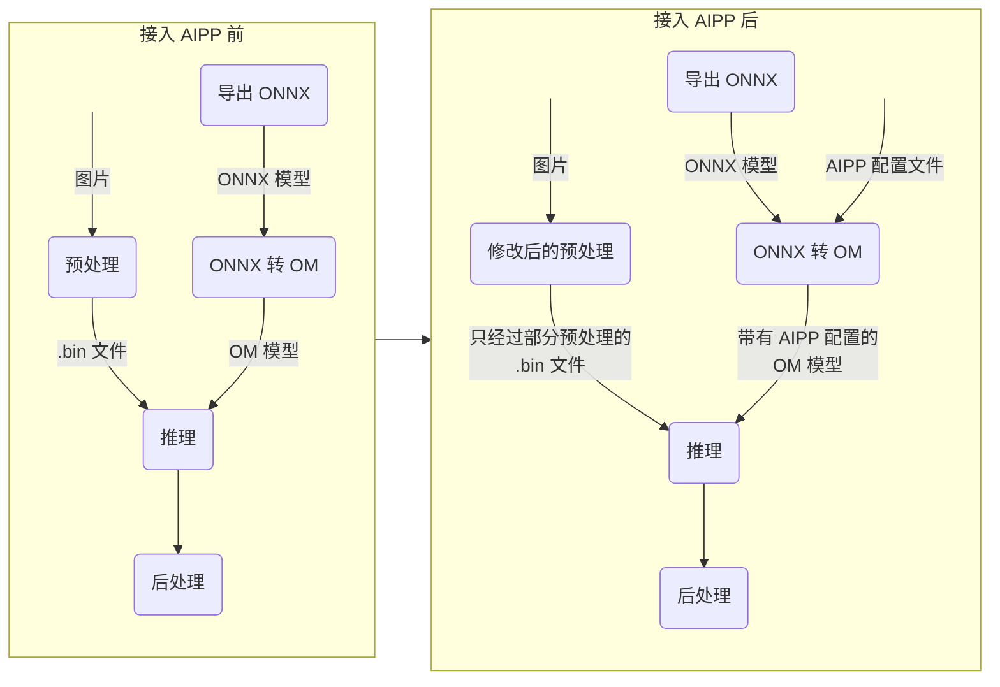

AIPP 分为静态 AIPP 和动态 AIPP。

- 静态 AIPP：模型生成后，AIPP 参数值被保存在离线模型中，每次推理只能使用固定的 AIPP 参数值。
- 动态 AIPP：每次推理可以使用不同的 AIPP 参数值。但也因为每次推理时需要计算参数，导致性能较差。

静态 AIPP 请参考 [ResNet50 使用静态 AIPP 的案例](05.01.ResNet50%20使用静态%20AIPP%20的案例.md)。

动态 AIPP 请参考 [动态 AIPP 配置示例](https://www.hiascend.com/document/detail/zh/CANNCommunityEdition/700alpha003/infacldevg/atctool/atlasatc_16_0020.html)（[CANN 社区版文档](https://www.hiascend.com/document/detail/zh/CANNCommunityEdition/700alpha003/processormodel/hardwaredesc_0001.html) > 应用开发 > ATC 模型转换 > 高级功能 > AIPP 使能 > AIPP 配置示例 > 动态 AIPP 配置示例）。

AIPP 的参数配置请参考 [AIPP 配置文件模板](https://www.hiascend.com/document/detail/zh/CANNCommunityEdition/700alpha003/infacldevg/atctool/atlasatc_16_0025.html)（[CANN 社区版文档](https://www.hiascend.com/document/detail/zh/CANNCommunityEdition/700alpha003/processormodel/hardwaredesc_0001.html) > 应用开发 > ATC 模型转换 > 高级功能 > AIPP 使能 > 配置文件模板）。

## AICPU算子转AI_CORE

当ATC转模型时遇到了如下的Warning信息：

```
W11001: Op [xxxxx] does not hit the high-priority operator information library, which might result in compromised performance.
```

说明该算子的运行在AICPU上，未匹配在性能更好的AI_CORE上。

改图知识库 [KnowledgeTypeCast](https://gitcode.com/ascend/msit/tree/master/msit/components/debug/surgeon/docs/knowledge_optimizer/knowledge_optimizer_rules.md#%E6%95%B0%E6%8D%AE%E7%B1%BB%E5%9E%8B%E8%BD%AC%E6%8D%A2-knowledgetypecast) 已经支持以下两种数据类型转换：

1. int64 -> int32
2. float64 -> float32

这两种数据类型转换场景可以优先使用改图命令进行转换:

```bash
python3 -m auto_optimizer optimize --knowledges KnowledgeTypeCast <INPUT_MODEL> <OUTPUT_MODEL>
````

如果知识库无法涵盖使用场景，可查看CANN包安装路径下的`ascend-toolkit/latest/opp/built-in/op_impl/ai_core/tbe/config/ascend310p/aic-ascend310p-ops-info.json`文件，可以得到算子在AI_CORE上支持的dtype类型，如下表示共支持6种场景，输入输出均为float16,float,int32,uint8,int8,bool时可运行在AI_CORE上。

```json
"input0":{
    "dtype":"float16,float,int32,uint8,int8,bool",
    "format":"ND,ND,ND,ND,ND,ND",
    "name":"x",
    "paramType":"required"
},
...
"output0":{
    "dtype":"float16,float,int32,uint8,int8,bool",
    "format":"ND,ND,ND,ND,ND,ND",
    "name":"y",
    "paramType":"required"
}
```

并根据实际场景对算子输入进行数据转换。

常见情况为输入是INT64格式（AICORE默认不支持INT64格式），这里提供通用的转换INT64数据节点为INT32的方案，其他格式转换原理类似：

```python
import numpy as np
from auto_optimizer import OnnxGraph

MININT32 = -2147483648
MAXINT32 = 2147483647

def value_to_int32(node):
    node_value = np.clip(node.value, MININT32, MAXINT32)
    node.value = node_value.astype(np.int32)
    return node

# 转换所有的Constant为Int32格式
def convert_all_constants(graph):
    constant_nodes = graph.get_nodes('Constant')
    for node in constant_nodes:
        if np.issubdtype(node.value.dtype, np.int64):
            node = value_to_int32(node)

# 转换所有的Initializer为Int32格式
def convert_all_initializers(graph):
    initializer_nodes = graph.get_nodes('Initializer')
    for node in initializer_nodes:
        if np.issubdtype(node.value.dtype, np.int64):
            node = value_to_int32(node)

def insert_cast_node(graph, before_node, node_name, dtype=6):
    cast_node = graph.add_node(
        node_name,
        'Cast',
        {'to': dtype}
    )
    graph.insert_node(before_node, cast_node, mode='after')

# 在特定类别算子后插入cast算子进行格式转换
def insert_cast_after_shape(graph, op_type):
    shape_nodes = graph.get_nodes(op_type)
    for node in shape_nodes:
        node_name = node.name
        insert_name = 'expand_after_{}'.format(node_name)
        insert_cast_node(graph, node_name, insert_name)

graph = OnnxGraph.parse('path/to/onnx/model')
# 在指定类别算子后插入cast算子，以Shape算子为例
insert_cast_after_shape(graph, 'Shape')
# 转换常量的数据格式
convert_all_initializers(graph)
convert_all_constants(graph)
# 保存模型
graph.save('path/to/new/onnx/model')
```

## 简化计算逻辑

当模型中存在冗余计算时，可通过等价替换的其他算子简化计算，提高模型性能。以下提供了一些应用场景

### 固定Resize算子的scales输入，手动常量折叠

**Resize算子功能**

Resize算子支持按照比例和固定size进行缩放，其中按照比例缩放的参数为scales，按照固定size缩放的参数为sizes。

**适用场景**

在此模型中，Resize算子是按照比例进行缩放，此处的Resize算子两个输入分别为X和scales，其中scales输入分支计算得到的是一个常量，此场景情况下，可以将scales输入分支进行常量折叠（删除），设置一个常量比例进行等价替换，一定程度可以提升整网性能。

**示意图**

Before

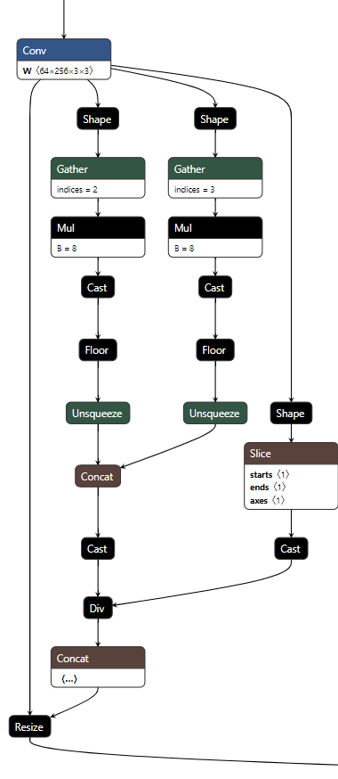

After

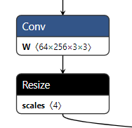

**代码**

[改图代码示例](https://gitcode.com/ascend/ModelZoo-PyTorch/blob/master/ACL_PyTorch/built-in/cv/DB_Dynamic_for_PyTorch/modify.py#L20)

### 删除无用的pad算子

**Pad算子功能**

Pad算子功能是将输入data按照参数pads进行填充。

**适用场景**

在此模型中，此处的Pad算子两个输入分别为data和pads，其中参数pads输入为全0，此场景情况下的Pad算子并没有对输入的data数据进行填充，此时可以将Pad算子删除，一定程度可以提升整网性能。

**示意图**

Before

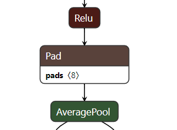

After

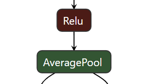

**代码**

[改图代码示例](https://gitcode.com/ascend/ModelZoo-PyTorch/blob/master/ACL_PyTorch/built-in/cv/Deepmar_for_Pytorch/remove_pad.py#L18)

### 删除冗余的Split算子

**Split算子功能**

Split算子功能是将输入的张量数据按照指定的轴拆分为张量列表。

**适用场景**

在此模型中，此处的Split算子只有1个输入为input，其属性参数分别为指定轴的axis和最大拆分数split，其中Split算子属性参数split为1，此场景情况下，此处的Split算子前后数据流没有改变，此时可以将Split算子删除，一定程度可以提升整网性能。

**示意图**

Before

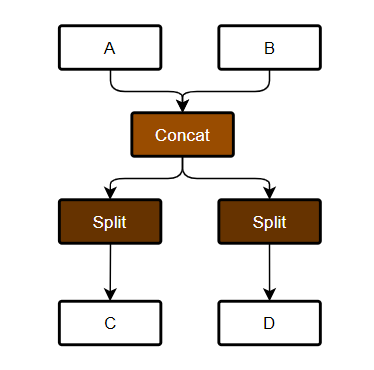

After

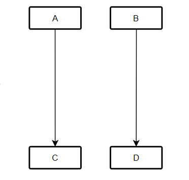

**代码**

[改图代码示例](https://gitcode.com/ascend/ModelZoo-PyTorch/blob/master/ACL_PyTorch/contrib/cv/classfication/PointNetCNN/PointNetCNN_modify_onnx.py#L18)

### 删除冗余的Resize

**Resize算子功能**

Resize算子支持按照比例和固定size进行缩放，其中按照比例缩放的参数为scales，按照固定size缩放的参数为sizes。

**适用场景**

在此模型中，Resize算子是按照固定sizes进行缩放，此处的Resize算子4个输入分别为X、roi、scales、sizes，其中scales输入分支通过Div->Shape->Slice->Concat得到的sizes和Div的sizes是相同的，所以将Div通过Rsize后，其shape没有发生改变，其余两个参数roi、scales均为空，此场景情况下，可以将Resize算子删除，一定程度可以提升整网性能。

**示意图**

Before

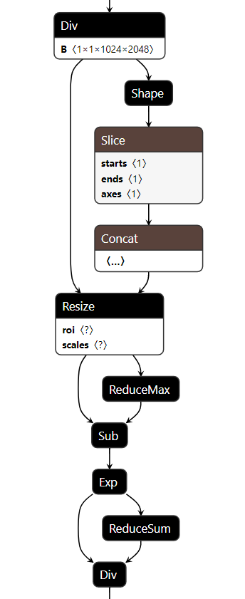

After

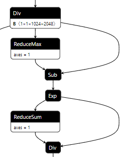

**代码**

[改图代码示例](https://gitcode.com/ascend/ModelZoo-PyTorch/blob/master/ACL_PyTorch/contrib/cv/segmentation/Segformer/optimize_onnx.py#L40)

## 消除算子

### 消除Reshape

Gemm算子和MatMul算子都支持矩阵计算，但Gemm仅支持2维数据的矩阵乘法，当数据的dims>2时，需要在前后添加reshape算子以支持Gemm计算，此时可以将Gemm算子转换为MatMul+Add算子，删除前后的Reshape以减少数据搬运。

Gemm算子有3个输入A、B、C和两个参数alpha、beta参与计算，计算逻辑为alpha*(A*B)+beta\*C，标准替换规则如下图，使用时根据实际场景简化不需要的算子。

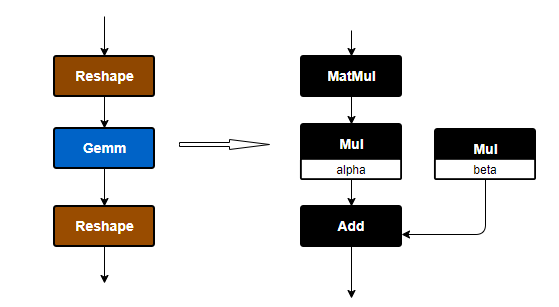

CRNN_Dynamic模型[改图代码示例](https://gitcode.com/ascend/ModelZoo-PyTorch/blob/master/ACL_PyTorch/built-in/cv/CRNN_Dynamic_for_PyTorch/fix.py#L22)

### 消除LayerNorm前后trandata

OM模型中，LayerNorm算子在输入shape的后两维都能被16整除的场景下，可以支持NZ数据格式。在Attention结构中，LayerNorm前后都有BatchMatMul的情况下，如果走NZ格式可以减少两个transdata算子，减少数据搬运的耗时。OM模型结构如图：

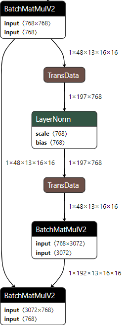

**适用场景：**当LayerNorm的维度为-1，且输入的最后一维可以被16整除时，可以通过对-2轴做padding，使其可以被16整除，来让LayerNorm算子走进NZ格式。不可以对进行LayerNorm的维度做padding操作，会导致输出结果变化。

**改图思路：**由于对BatchMatmul算子的整行进行padding，不会影响到原本的数据结果，可以在图中BatchMatmul算子前进行padding，并在影响结果前将数据还原至原shape，则可以消除transdata。模式示例如下，在该结构前后分别使用Concat算子和Slice算子进行补齐和还原操作：

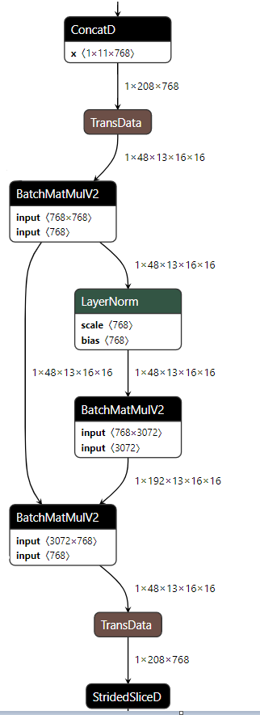

ViT_base模型[改图代码示例](https://gitcode.com/ascend/ModelZoo-PyTorch/blob/master/ACL_PyTorch/contrib/cv/classfication/ViT_base/opt_vit.py#L171)

### ConvTranspose+Add 优化

**适用场景**

当ConvTranspose算子只有一个输出且后面与Add算子相连时，可以将Add的值作为bias添加进ConvTranspose，这样的目的是在ATC时使之能与后面的BatchNormalization融合

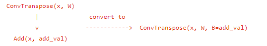

**示意图**

改图前

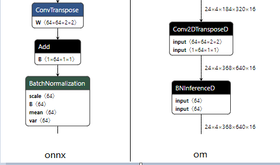

改图后

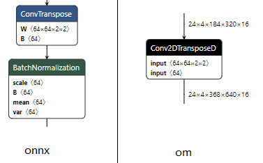

可以发现当改图后ConvTranspose算子与BatchNormalization算子相连，这时atc后这两个算子就会融合在一起，否则BatchNormalization不会融合

**代码**

代码示例见**DBNet\_MobileNetV3\_for\_POC**[改图脚本](https://gitcode.com/ascend/ModelZoo-PyTorch/blob/master/ACL_PyTorch/built-in/cv/DBNet_MobileNetV3_for_POC/modify_onnx.py)

## 算子优化

针对某些常用结构，昇腾已经适配了性能更好的算子来提升性能，下列给出一些常用的算子优化。

### 融合算子

一些常用的融合算子也可以提升模型性能，在模型结构满足融合条件，可通过内置的FusionPass进行融合。有些模型的原始结构可能不符合融合条件，但实际计算逻辑相同，此时可以通过等价改图转换为可识别的结构，以获得更好的性能。

#### AttentionLnQKV和AttentionScore

BERT类的transformer中的Attention结构可以通过使用AttentionLnQKV和AttentionScore算子提升性能。AttentionLnQKV和AttentionScore可匹配的结构如下，AttentionLnQKV的前面省略了LayerNorm和BatchMatmul算子：

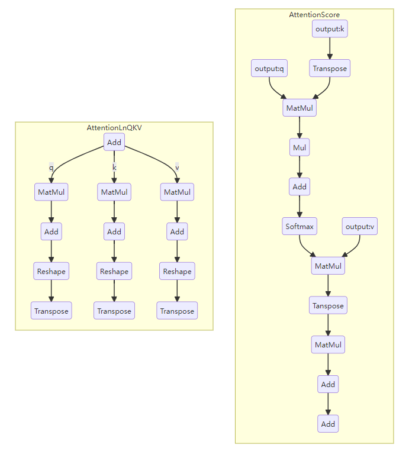

但Attention结构有多中变体，需要先通过一定规则转换为标准Attention结构，匹配AttentionLnQKV和AttentionScore条件。目前auto_optimizer已提供了Attention结构的通用适配知识库，可使用知识库快速完成[AttentionLnQKV和AttentionScore适配](https://gitcode.com/ascend/msit/tree/master/msit/components/debug/surgeon/docs/knowledge_optimizer/knowledge_optimizer_rules.md#transform%E6%A8%A1%E5%9E%8B%E5%A4%A7kernel%E4%BC%98%E5%8C%96)

#### SwinTransformerLnQKV和SwinAttentionScore

由于Vit-Transformer中的Attention结构与标准Attention不同，针对SwinTransformer结构中的Attention，目前已适配了SwinTransformerLnQKV和SwinAttentionScore算子以提升性能，算子可匹配的结构如下，SwinTransformerLnQKV的前面省略了LayerNorm和BatchMatmul算子：

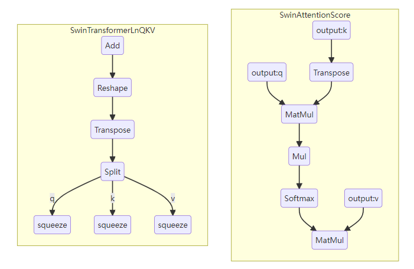

如果ONNX模型结构不能直接适配算子，需要通过改图将ONNX模型结构修改为上图结构。

### 自定义算子

针对某些场景，我们也提供了一些自定义算子，可以替代模型中部分结构并得到更好的模型性能。由于自定义算子无法直接通过FusionPass识别模型结构，需要手动将模型中的结构替换为自定义算子。

#### FlashAttentionSoftmaxFp32 优化

针对动态场景下BERT模型的Attention结构，提供FlashAttentionSoftmaxFp32 算子，该算子当前仅支持DUO卡进行使用。使用时需要安装MindIE的算子包并设置对应的环境变量。

FlashAttentionSoftmaxFp32 算子的计算逻辑如下所示，使用时需要将这部分结构替换为一个FlashAttentionSoftmaxFp32 算子，可参考[适配案例](https://gitee.com/zheng-wengang1/ModelZoo-PyTorch/blob/master/ACL_PyTorch/built-in/nlp/Bert_Uncased_Huggingface/fix_onnx2unpad.py)进行适配。

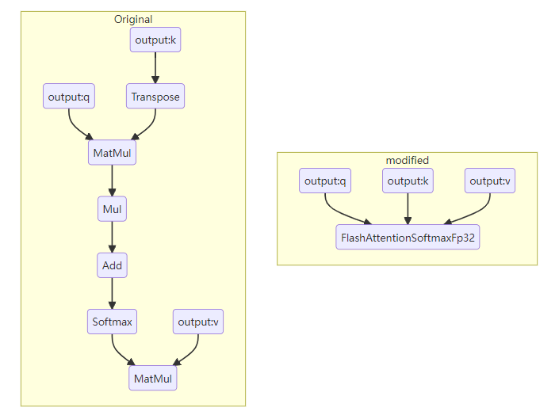

**算子输入要求**

- query：Attention中计算得到的value，数据shape为[batch, qSeqLen, hiddenSize]
- key：Attention中计算得到的value，数据shape为[batch, kvSeqLen, hiddenSize]
- value：Attention中计算得到的value，数据shape为[batch, kvSeqLen, hiddenSize]
- qSeqLen：query的seq_len数据，数据类型为int32。数据shape为[batch]
- kvSeqLen：key和value的seq_len数据，数据类型为int32。数据shape为[batch]
- mask：可选，数据shape为[batchMask, headsMask qSeqLen, kvSeqLen]

说明：

- batchMask根据实际场景需要，可以是1，也可以等于batch。当batchMask=1时，不同batch共享同一份mask。
- headsMask根据实际场景需要，可以是1，也可以等于heads。当headsMask=1时，不同heads共享同一份mask。

#### DeformableConv2D

2023-5-26，ONNX 发布 Opset 19，此次发布新增了可变形卷积 [DeformConv](https://github.com/onnx/onnx/blob/main/docs/Changelog.md#DeformConv-19) 算子。但发布日期较晚，常用的模型库/框架在导 ONNX 时仍然使用自定义的可变形卷积算子，由于规格上的差异，这些自定义算子会导致 ONNX 转 OM 失败。这里以 [MMCVDeformConv2d](https://mmcv.readthedocs.io/zh-cn/latest/deployment/mmcv_ops_definition.html#mmcvdeformconv2d) 为例，介绍通过 ONNX 改图的方式来适配 CANN 中的可变形卷积算子。当然，也可以通过修改 mmcv 源码来达到同样的目的，可参考[CascadeRCNN-DCN-101模型](https://gitcode.com/ascend/ModelZoo-PyTorch/tree/master/ACL_PyTorch/built-in/cv/CascadeRCNN-DCN-101_for_Pytorch)。

执行 atc 命令时，ONNX 中的各算子通过 ONNX 适配插件完成到 CANN 中算子的映射，要想完成映射，首先需要清楚 ONNX 适配插件可接受的算子规格：

+ 算子输入
  
    | 输入名 | 次序 |  排布格式 | 说明 |
    | ------- | ---- | ---------- |------ |
    | x         | 0     | NCHW     | 输入数据  |
    | filter   | 1     |  NCHW    |  卷积核    |
    | offsets | 2    | NCHW     | 偏移量，沿C轴可以均分为三等分：<br />1) 水平偏移量offset_x；<br />2) 竖直偏移量offset_y；<br />3) 掩码mask。<br />当实际场景下无mask输入时，需将mask的所有元素设为 1。|
    | bias     | 3    | ND           | 可选，卷积偏置 |
  
  
+ 算子输出
  
    | 输出名 | 次序 |  排布格式 | 说明 |
    | ------- | ---- | ---------- |------ |
    | y         | 0     | NCHW     | 输出数据  |
  
  
+ 算子属性
  
    | 属性名 | 说明 |
    | ------ | ---- |
    | strides | 卷积步长，用法同普通的卷积操作，表示滑动窗口的步长 |
    | pads    | 填充数， 用法同普通的卷积操作，表示上下左右四个方向上的填充像素数 |
    | dilations | 可选， 空洞卷积时设置此参数，默认为 [1, 1, 1, 1] |
    | groups | 可选, 用法同普通的卷积操作 |
    | data_format | 可选，输入数据的排布格式 |
    | deformable_groups | 可选，可变形组的数量。输入数据的通道数必须可被此属性整除。默认值为1 |
    | modulated | 可选. 指定可变形卷积的版本, true 表示 v2, false 表示 v1, 当前仅支持 v2 |
  
  
+ 其他特性
  op_type: DeformableConv2D

然后需要检查当前ONNX中的可变形卷积算子是否满足以上的规格。

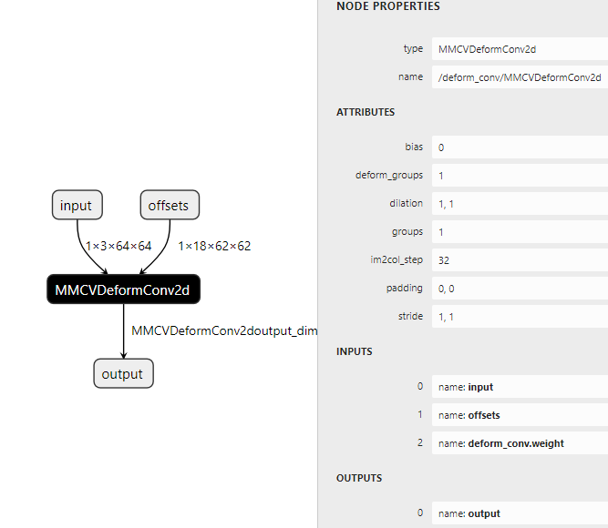

使用 [Netron](https://netron.app/) 打开 ONNX，点击可变形卷积节点，右侧信息栏将会展示可变形卷积算子的信息，如上图。根据Netron提供的信息，再结合 mmcv 官方文档对此算子的[说明](https://mmcv.readthedocs.io/zh-cn/latest/deployment/mmcv_ops_definition.html#mmcvdeformconv2d)，找到不满足ONNX适配插件规格的地方，然后有针对性的做出修改。

1. 首先加载需要修改的ONNX，做好改图的准备工作
   这里使用 auto_optimizer 工具修改 ONNX 模型，此工具的安装以及用法，请参考该工具的 [Gitcode 主页](https://gitcode.com/ascend/msit/tree/master/msit/components/debug/surgeon)。
   
   ```python
   import numpy as np
   from auto_optimizer import OnnxGraph
   
   onnx_path = './deform_conv2d.onnx'
   graph = OnnxGraph.parse(onnx_path)
   
   old_dc_node_name = '/deform_conv/MMCVDeformConv2d'
   new_dc_node_name = '/deform_conv/CANNDeformConv2d'
   
   batchsize = 1
   offset_channel = 18
   output_height = 62
   output_width = 62
   ```
2. 算子类型（op_type）不一致
   修改ONNX时，无法直接修改某个节点的 op_type，可以重新生成一个目标 op_type 的节点，然后将老节点的输入输出、属性复制给新节点，最后将老节点删除。
   
   ```python
   # insert a new node below old node
   old_dc_node = graph[old_dc_node_name]
   new_dc_node = graph.add_node(new_dc_node_name, 'DeformableConv2D')
   graph.insert_node(old_dc_node_name, new_dc_node, mode='after')
   
   # copy inputs and attributes
   new_dc_node.inputs = old_dc_node.inputs
   new_dc_node.attrs = old_dc_node.attrs
   
   # delete old node
   graph.remove(old_dc_node_name)
   ```
3. 部分属性名不一致
   
   ```python
   # rename attributes
   new_dc_node.attrs['deformable_groups'] = new_dc_node.attrs.pop('deform_groups')
   new_dc_node.attrs['dilations'] = new_dc_node.attrs.pop('dilation')
   new_dc_node.attrs['pads'] = new_dc_node.attrs.pop('padding')
   new_dc_node.attrs['strides'] = new_dc_node.attrs.pop('stride')
   ```
4. offset的内容与排布格式存在差异
   MMCVDeformConv2d 算子输入中的 offset，仅包含竖直偏移量 offset_y 与 水平偏移量 offset_x，交替排列，差异如下：
   
   ```
   # https://github.com/open-mmlab/mmcv/blob/v2.1.0/mmcv/ops/deform_conv.py#L321
   # MMCVDeformConv2d offset is like:
   [y0, x0, y1, x1, y2, x2, ...]
   
   # CANN DeformConv2d offset is like:
   [x0, x1, x2, ..., y0, y1, y2, ..., mask0, mask1, mask2, ...]
   ```
   
   参考以下代码，在 offset 输入可变形卷积节点前，插入多个算子修改 offset_x 与 offset_y 的排布，并且添加全 1 的 mask。
   
   ```python
   # insert Reshape node
   reshape_node0 = graph.add_node(f'NewReshape0_for_{new_dc_node_name}', 'Reshape')
   graph.insert_node(new_dc_node.name, reshape_node0, refer_index=1, mode='before')
   new_shape = np.array([batchsize, offset_channel // 2, 2, output_height, output_width], np.int64)
   reshape_node0.inputs.append(graph.add_initializer(f'{reshape_node0.name}_init', new_shape).name)
   
   # insert Split node to split original offset to offset_y and offset_x
   split_node = graph.add_node(
       f'NewSplit_for_{new_dc_node_name}', 'Split', attrs={'axis': 2, 'split': [1, 1]})
   graph.insert_node(reshape_node0.name, split_node, mode='after')
   split_node.outputs.append(f'{split_node.name}_output_1')
   
   # create mask with full value 1 and concatenate (offset, mask)
   mask_init = graph.add_initializer(
       f'mask_for_{new_dc_node_name}', 
       np.ones((batchsize, offset_channel // 2, 1, output_height, output_width)).astype(np.float32)
   )
   cat_node = graph.add_node(f'NewConcat_for_{new_dc_node_name}', 'Concat', attrs={'axis': 1})
   graph.insert_node(split_node.name, cat_node, refer_index=1, mode='after')
   cat_node.inputs.extend([split_node.outputs[0], mask_init.name])
   
   # insert Reshape node to unsqueeze axis 2
   reshape_node1 = graph.add_node(f'NewReshape1_for_{new_dc_node_name}', 'Reshape')
   graph.insert_node(cat_node.name, reshape_node1, mode='after')
   reshape_node1.inputs.append(
       graph.add_initializer(
           f'{reshape_node1.name}_init', 
           np.array([batchsize, offset_channel // 2 * 3, output_height, output_width], np.int64)
       ).name
   )
   ```
5. 输入顺序不一致
   MMCVDeformConv2d 算子的输入顺序依次为：input，offset，weight，而ONNX适配插件接受的输入顺序为：x(input)，filter(weight)，offsets(offset)。参考以下代码进行修改。
   
   ```python
   new_dc_node.inputs[1] = new_dc_node.inputs[2]
   new_dc_node.inputs[2] = reshape_node1.outputs[0]
   ```
6. 至此差异点排查完毕，修改后的模型已满足ONNX适配插件的映射条件，最后保存修改后的模型即可
   
   ```python
   graph.infer_shape()
   graph.save('./deform_conv2d_modified.onnx')
   ```

修改后的 ONNX 模型如下：

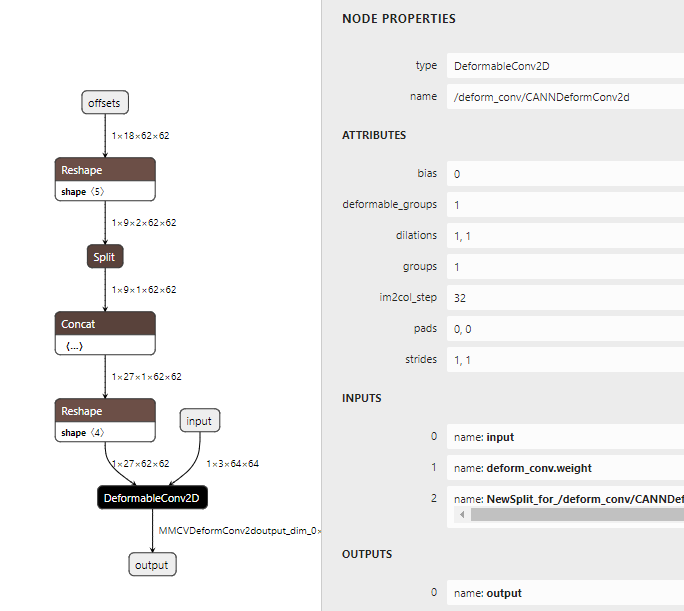

使用修改后的 ONNX 即可成功转出 OM，如下图：

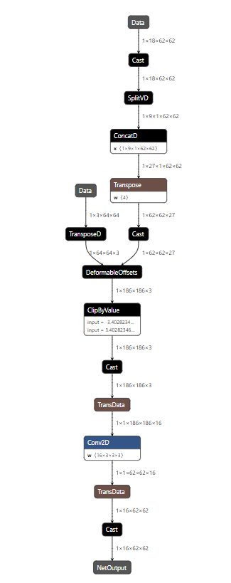

#### BatchMultiClassNonMaxSuppression

NMS（非极大值抑制操作）是目标检测、实例分割算法中常用的操作，CANN 中实现此操作的算子有两个：

1. NonMaxSuppression
2. BatchMultiClassNonMaxSuppression

NonMaxSuppression 规格与 ONNX 同名算子一致，atc 模型转换时，可以直接从 ONNX 经适配插件映射到 CANN。BatchMultiClassNonMaxSuppression 算子与前者稍有差别，实际使用更频繁。从经验上来讲更推荐后者，原因如下：

- NonMaxSuppression 输出为 NMS 后的检测框索引，其后往往会接取值操作，用来从所有检测框中找出与索引对应的检测框，有些模型甚至会在此算子前后插入 TopK 等冗余操作。而上述所有操作用 BatchMultiClassNonMaxSuppression 可以一步完成；
- BatchMultiClassNonMaxSuppression 性能更优；
- NonMaxSuppression 可能会导致模型内部动态，不便于模型的优化。

下面介绍如何修改 ONNX 图中的 NonMaxSuppression 算子，使模型在转为 OM 后，可以适配到 BatchMultiClassNonMaxSuppression 算子。

**规格差异**

参考 [ONNX 算子清单](https://onnx.ai/onnx/operators/onnx__NonMaxSuppression.html#nonmaxsuppression-11) 与 [CANN 算子清单](https://www.hiascend.com/document/detail/zh/CANNCommunityEdition/80RC1alpha001/apiref/operatorlist/operatorlist_0318.html)，可发现 ONNX 中的 NonMaxSuppression 与 CANN 中 BatchMultiClassNonMaxSuppression 的规格差异主要在以下几点：

1. 输入算子的 boxes、scores 的 shape 不一致；
2. NonMaxSuppression 的三个输入在 BatchMultiClassNonMaxSuppression 中为属性；
3. 输出不一致，BatchMultiClassNonMaxSuppression 直接输出经 NMS 筛选后的检测框，以及对应的置信度、类别。

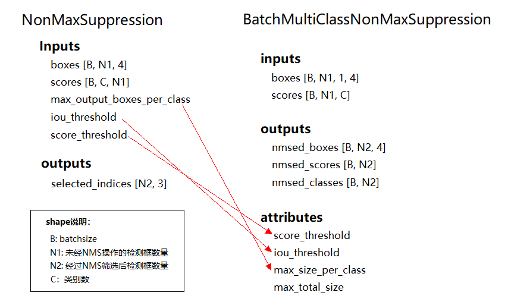

对第 1、2 点的修改相对简单，如下：

```python
import numpy as np
from auto_optimizer import OnnxGraph
from onnx import numpy_helper

graph = OnnxGraph.parse('/path/to/model.onnx')    # 按实际情况修改模型路径
nms_name = 'YourNonMaxSuppressionNodeName'    # 按实际情况修改NMS节点名
nms_node = graph[nms_name]

# 插入 Unqueeze 节点对原 boxes 输入进行扩维，即 boxes = boxes.unsqueeze(dim=2)
boxes_unsqueeze = graph.add_node(
	f'unsqueeze_boxes_before_{nms_name}', 'Unsqueeze', attrs={'axes': [2]})
graph.insert_node(nms_name, boxes_unsqueeze, refer_index=0, mode='before')

# 对原 scores 进行 Transpos 操作，即 scores = scores.transpose(1, 2)
scores_transpose = graph.add_node(
	f'transpose_scores_before_{nms_name}', 'Transpose', attrs={'perm': [0, 2, 1]})
graph.insert_node(nms_name, scores_transpose, refer_index=1, mode='before')

# 插入新节点，将原 NMS 节点的后三个输入改为新 NMS 节点属性
bcnms_name = nms_name.replace('NonMaxSuppression', 'BatchMultiClassNonMaxSuppression')
bcnms_node = graph.add_node(
    bcnms_name, 
    'BatchMultiClassNMS',  # 注意此处的op_type，ONNX适配插件只接受 BatchMultiClassNMS
    attrs=dict(
        max_size_per_class=numpy_helper.to_array(graph[nms_node.inputs[2]].attrs['value']).item(),
        iou_threshold=numpy_helper.to_array(graph[nms_node.inputs[3]].attrs['value']).item(),
        score_threshold=numpy_helper.to_array(graph[nms_node.inputs[4]].attrs['value']).item(),
        max_total_size=numpy_helper.to_array(graph[nms_node.inputs[2]].attrs['value']).item(),
    )
)
graph.insert_node(nms_name, bcnms_node, refer_index=0, mode='before')
bcnms_node.inputs.append(nms_node.inputs[1])
```

NonMaxSuppression 节点一般出现在目标检测模型的末尾，如果是 two-stage，则 RPN 网络末尾也会存在 NonMaxSuppression 节点，这两处 NMS 操作的下游处理流程是存在差别的。对于整个模型尾部的 NonMaxSuppression 节点，其后的处理流程是根据 NonMaxSuppression 输出的索引找到对应的检测框、置信度、类别，然后将这三组数据输出模型。这一过程在不同的模型中有不同的实现，很难提炼出统一的改图代码。

因此，**在对上述第 3 点差别做修改时，需要在 ONNX 图中找到 NonMaxSuppression 下游节点，查询 [ONNX 官方文档](https://onnx.ai/onnx/operators/index.html)了解各节点功能并理解在当前语境下的作用。可以借助 numpy 或者 torch 模拟推导过程，梳理出这些下游节点的行为逻辑，找出首次输出检测框、置信度的地方，以此作为 BatchMultiClassNonMaxSuppression 的输出。**

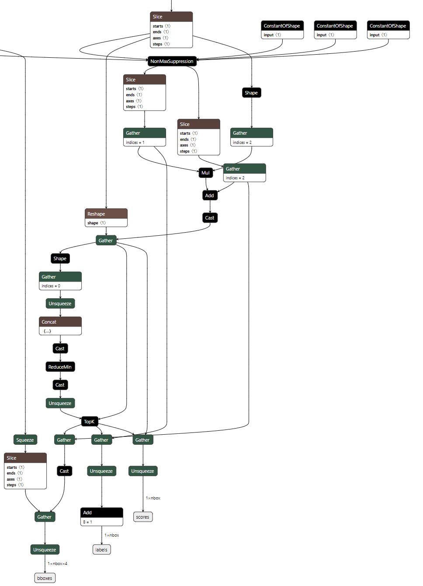

上图是 [SSD-ResNet34](https://zenodo.org/record/3228411/files/resnet34-ssd1200.onnx) 模型尾部的 ONNX 截图，在经过 NonMaxSuppression 节点后，下游又插入多个 Gather、Slice、TopK 等节点进行取值，目的是获取到模型的三个输出： boxes、scores、labels。而刚好 BatchMultiClassNonMaxSuppression 也对应输出这三组数据，只不过需要注意：

- 模型输出 labels 前会进行一个 Add 操作
- 下游包含一个 TopK 节点，但无论 NonMaxSuppression 还是 BatchMultiClassNonMaxSuppression，均在内部进行过 TopK 操作，所以，下游的 TopK 节点是冗余的，可以直接删除。

接下来，遵循上述分析来为新插入的 BatchMultiClassNonMaxSuppression 算子指定输出：

```python
# 删除旧的连边，为新 NMS 节点指定输出
graph.get_prev_node('bboxes').outputs[0] = ''
bcnms_node.outputs[0] = 'bboxes'
graph.get_prev_node('scores').outputs[0] = ''
bcnms_node.outputs.append('scores')
add_label_node = graph['Add_labels']
graph.get_prev_node(add_label_node.inputs[0]).outputs[0] = ''
bcnms_node.outputs.append(add_label_node.inputs[0])

# 删除旧 NMS 以及下游节点
graph.remove(nms_name)
graph.remove_unused_nodes()

# 至此，修改完毕，保存修改完的模型
graph.save('/path/to/modified.onnx')
```

修改后的 ONNX 以及对应的 OM 如下：

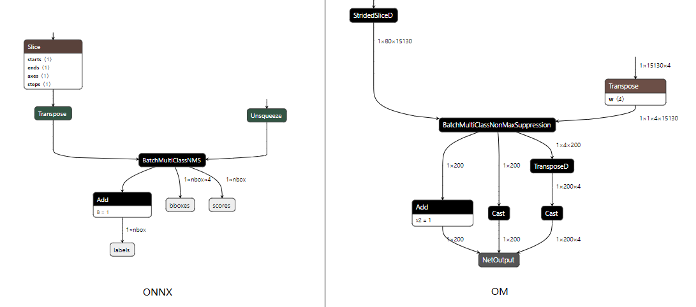
