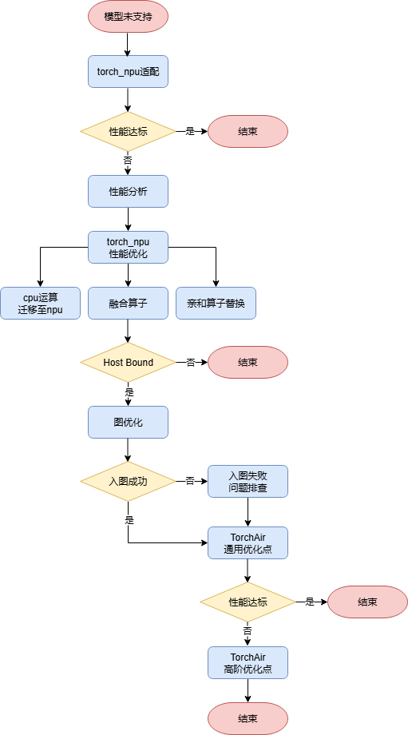

## TorchAir介绍
TorchAir（Torch Ascend Intermediate Representation）是昇腾Ascend Extension for PyTorch(torch_npu)的图模式能力扩展库，提供了昇腾设备亲和的torch.compile图模式后端，实现了PyTorch网络在昇腾NPU上的图模式推理加速及性能优化。

目前TorchAir暂未提供单独的发布包，而是作为Ascend Extension for PyTorch的三方库，随着torch_npu一起发布。请直接安装torch_npu插件，即可使用TorchAir。

## 常用概念

| 名称      | 说明     | 
| ----------|--------|
| Eager模式 | PyTorch支持的单算子执行模式（未使用torch.compile）。Eager模式执行特点如下，1. 即时执行：每个计算操作在定义后立即执行，无需构建计算图；2. 动态计算图：每次运行可能生成不同的计算图。 | 
| 图模式    | 一般指使用torch.compile加速的模型执行方式。图模式执行特点如下，1. 延迟执行：所有计算操作先构成一张计算图，再在会话中下发执行；2. 静态计算图：计算图在运行前固定。 |

## 模型适配和性能调优流程

1. [torch_npu迁移适配](torch_npu/torch_npu迁移适配.md): 用户使能图模式之前，请先将模型迁移至昇腾NPU上，确保能够在单算子模式（Eager）下正确执行
2. [torch_npu性能优化](torch_npu/常用优化点.md): 模型性能涉及包括算法在内的多个模块，因此模型性能的优化的关键在于找到当前性能瓶颈，找到关键问题后再针对性优化。小模型一般运行在单卡上，因此本章节主要从计算和下发角度介绍常用的torch_npu性能优化方法。
3. [图优化](图优化/1.前置分析及约束条件.md): 当Host侧任务下发耗时超过Device侧任务执行耗时，Device会因等待新任务而处于空闲状态，形成性能瓶颈，即Host Bound问题。图模式具备"延迟执行"和"静态计算图"两个特点，可以有效优化算子下发，解决Host Bound问题。本章节主要介绍TorchAir常用配置、迁移适配流程、功能精度问题定位方法等。

**图1** 性能调优流程图

更多介绍请参考昇腾社区[TorchAir官方介绍文档](https://www.hiascend.com/document/detail/zh/Pytorch/710/modthirdparty/torchairuseguide/torchair_00003.html)