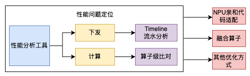

# 基本优化流程
模型性能设计包括算法在内的多个模块，因此模型性能的优化的关键在于找到当前性能瓶颈，找到关键问题后再针对性优化，优化流程如下：



1. 参考[性能调优工具介绍](https://www.hiascend.com/document/detail/zh/Pytorch/710/ptmoddevg/trainingmigrguide/performance_tuning_0014.html)，选择对应的性能工具，采集性能数据并拆解性能，找到需要提升性能的模块。
2. 在明确性能瓶颈模块后，将问题细化定位到下发、计算等模块，并采用对应的优化手段。

# 常用优化点
## cpu操作迁移至npu
该步骤为**重要优化点**！

*  有一些算子或者数据类型不支持在npu上运行，可以用等价的npu算子，或者逻辑等价的代码去替换，让这段代码可以在npu上运行

    示例：

    ```python
    # 比如语音模型中常用到傅里叶变换，output为复数，npu不支持复数类型计算，可以用torch.view_as_real()提取实数和虚数部分再进行计算。
    ''' 原始代码
    audio = torch.from_numpy(audio)   # cpu tensor
    window = torch.hann_window(N_FFT) # cpu tensor
    stft = torch.stft(audio, N_FFT, HOP_LENGTH, window=window, return_complex=True) # stft为复数
    magnitudes = stft[..., -1].abs() ** 2 # npu不支持对复数做abs()计算
    '''

    # 替换为：
    audio = torch.from_numpy(audio).npu()  # 把tensor放到npu上
    window = torch.hann_window(N_FFT).to(audio.device)
    stft = torch.stft(audio, N_FFT, HOP_LENGTH, window=window, return_complex=True)
    stft_real_img = torch.view_as_real(stft)[..., :-1, :]  # 将复数的实数和虚数部分拆解出来
    real_part = stft_real_img[..., 0]
    img_part = stft_real_img[..., 1]
    magnitudes = real_part ** 2 + img_part ** 2  # 数学逻辑等价于复数.abs()**2
    ```

* 将cpu tensor转到npu上

    示例：
    ```python
    ''' 原始代码
    waveforms = torch.empty(0)
    feats_pad = torch.empty(0)
    feats_lens = torch.empty(0)
    '''
    # 修改为:
    waveforms = torch.empty(0, device=kwargs["device"])
    feats_pad = torch.empty(0, device=kwargs["device"])
    feats_lens = torch.empty(0, device=kwargs["device"])
    ```

## 融合算子替换
通过数学意义上的等价替换，将多个算子融合为一个算子的计算，减少冗余计算，同时减少下发次数，从而提高性能。

### RotaryMul
transformer结构中通常会用到位置编码，旋转位置编码（Rotary Position Embedding）是一种常用的位置编码方式。旋转编码一般在transformer的Attention模块中，在计算完query, key的映射后加入旋转位置编码。

torch_npu接口：
```python
torch_npu.npu_rotary_mul(x, r1, r2)
```

参数说明：
* x: q, k, shape要求输入为4维，一般为[B, N, S, D]或[B, S, N, D]或[S, B, N, D]。
* r1：cos值，shape要求输入为4维，一般为[1, 1, S, D]或[1, S, 1, D]或[S, 1, 1, D]。
* r2：sin值，shape要求输入为4维，一般为[1, 1, S, D]或[1, S, 1, D]或[S, 1, 1, D]。

示例：
```python
'''原始接口
def rotate_half(x):
    x1 = x[..., : x.shape[-1] // 2]
    x2 = x[..., x.shape[-1] // 2:]
    return torch.cat((-x2, x1), dim=1)

def apply_rotary_pos_emb(q, k, cos, sin, offset: int = 0):
    q_embed = (q * cos) + (rotate_half(q) * sin)
    k_embed = (k * cos) + (rotate_half(k) * sin)
    return q_embed, k_embed
'''

# 替换为：
def apply_fused_rotary_pos_emb(q, k, cos, sin, offset: int = 0):
    return torch_npu.npu_rotary_mul(q, cos, sin), torch_npu.npu_rotary_mul(k, cos, sin)
```

**使用限制**
目前算子仅支持r1、r2需要broadcast为x的shape的情形，且算子shape中最后一维D必须是128的倍数。

### FlashAttention算子
如果原始代码中使用小算子来计算attention score，我们可以使用npu的flash attention融合算子提升性能，prefill阶段使用[torch_npu.npu_prompt_flash_attention](https://www.hiascend.com/document/detail/zh/Pytorch/710/apiref/torchnpuCustomsapi/context/torch_npu-npu_prompt_flash_attention.md)，decode阶段使用[torch_npu.npu_incre_flash_attention](https://www.hiascend.com/document/detail/zh/Pytorch/710/apiref/torchnpuCustomsapi/context/torch_npu-npu_incre_flash_attention.md)

小算子样例：
```python
scores = torch.matmul(q, k.transpose(-2, -1))
scores = scores.masked_fill(mask, min_value)
attn = torch.softmax(scores, dim=-1).masked_fill(mask, 0.0)
x = torch.matmul(attn, value)
```

重写attention模块的forward方法：
```python
# Prefill用PFA
...
n_ctx = q.shape[1]
...
if n_ctx > 1:
    mask = mask.to(torch.bool) if mask is not None and n_ctx > 1 else None
    sparse_mode = 1 if mask is not None and n_ctx > 1 else 0
    attn = torch_npu.npu_prompt_flash_attention(
        q.contiguous(),
        k.contiguous(),
        v.contiguous(),
        num_heads=self.n_head,
        input_layout="BNSD",
        scale_value=1 / math.sqrt(D),
        atten_mask=mask[:n_ctx, :n_ctx] if mask is not None else None,
        sparse_mode=sparse_mode
    )
# Decode用IFA
else:
    attn = torch_npu.npu_incre_flash_attention(
        q.contiguous(),
        k.contiguous(),
        v.contiguous(),
        num_heads=self.n_head,
        input_layout="BNSD",
        scale_value=1 / math.sqrt(D),
        atten_mask=None,
        actual_seq_lengths=actual_seq_len,
        kv_padding_size=kv_padding_size
    )
```

其他融合算子请参考：[融合算子](https://www.hiascend.com/document/detail/zh/Pytorch/710/ptmoddevg/trainingmigrguide/performance_tuning_0031.html)

## qkv融合

优化思路：针对带有attention模块的模型，可以将q, k, v三个矩阵替换为一个矩阵乘，最大化使用npu的计算能力提升性能

实现方式：

```python
class Model(nn.Module):
    def __init__(self):
        super().__init__()
        # 新增qkv大矩阵
        self.qkv = nn.Linear(self.hidden_size, self.num_heads * self.head_dim +
            2 * self.num_key_value_heads * self.head_dim, bias=False)
        ...
    
    def forward(self, hidden_states):
        '''原始qkv linear层
        query_states = self.q_proj(hidden_states)
        key_states = self.k_proj(hidden_states)
        value_states = self.v_proj(hidden_states)
        '''

        # 替换为
        qkv_states = self.qkv(hidden_states)
        query_states, key_states, value_states = qkv_states.split(
            [self.q_hidden_size, self.kv_hidden_size, self.kv_hidden_size], dim=2)
    
    # 权重融合，将原始q,k,v linear的权重放到qkv大矩阵中
    def merge_qkv_weight(self, tp_size=1):
        def _to_parameter(data):
            return nn.Parameter(data, requires_grad=False)

        qw_size = self.model.layers[0].self_attn.q_proj.weight.shape
        kw_size = self.model.layers[0].self_attn.k_proj.weight.shape
        vw_size = self.model.layers[0].self_attn.v_proj.weight.shape

        q_sliced_size = qw_size[0] // tp_size
        k_sliced_size = kw_size[0] // tp_size
        v_sliced_size = vw_size[0] // tp_size

        for i in range(len(self.model.layers)):
            qw = self.model.layers[i].self_attn.q_proj.weight
            kw = self.model.layers[i].self_attn.k_proj.weight
            vw = self.model.layers[i].self_attn.v_proj.weight

            weight_list = []
            for j in range(tp_size):
                sliced_qw = qw[j * q_sliced_size: (j + 1) * q_sliced_size, :]
                sliced_kw = kw[j * k_sliced_size: (j + 1) * k_sliced_size, :]
                sliced_vw = vw[j * v_sliced_size: (j + 1) * v_sliced_size, :]
                weight_list.append(_to_parameter(torch.cat([sliced_qw, sliced_kw, sliced_vw], axis=0)))

            if len(weight_list) == 1:
                self.model.layers[i].self_attn.qkv.weight = weight_list[0]
            else:
                self.model.layers[i].self_attn.qkv.weight = _to_parameter(torch.cat(weight_list, axis=0))
```


### 固定kv cache大小

优化原因：如果kv cache是作为模型的输入，在模型中cat拼接后返回新的kv cache，这种更新方式存在多次申请内存及拷贝的性能损失。

优化方式：根据句子最大长度申请好一块固定大小的kv cache tensor，然后通过scatter_update_算子对指定位置上的kv cache进行更新

以transformers的llama源码为例：

```python
# transformers/models/llama/modeling_llama.py
# LlamaForCausalLM的prepare_inputs_for_generation函数新增逻辑
# 固定kv cache的大小，用作全量图和增量图的kv cache更新
batch_size, seq_length = input_ids.shape
use_dtype = self.model.torch_dtype
if past_key_values is None:
    kv_shape = (
        batch_size, self.model.max_position_embeddings, self.model.num_key_value_heads // self.world_size,
        self.model.hidden_size // self.model.num_attention_heads)
    past_key_values = ()
    for i in range(self.model.num_hidden_layers):
        k_cache = torch.zeros(kv_shape, dtype=use_dtype, device=input_ids.device)
        v_cache = torch.zeros(kv_shape, dtype=use_dtype, device=input_ids.device)
        past_key_values += ((k_cache, v_cache),)
```

更新kv的改动：
```python
# 更新指定位置上的kv cache，position_ids在全量图执行时从seq_len 0的位置更新，在增量图执行时从seq_len位置更新
tmp_ids = updated_kv_positions.reshape(-1)
# format BSND, 1 means seq_len dim index
torch_npu.scatter_update_(past_key_value[0], tmp_ids, key_states, 1)
torch_npu.scatter_update_(past_key_value[1], tmp_ids, value_states, 1)

key_states1 = past_key_value[0] if q_len == 1 else key_states
value_states1 = past_key_value[1] if q_len == 1 else value_states

past_key_value = past_key_value if use_cache else None
```

固定kv cache后，由于shape变化带来的其他改动：
```python
# prepare_inputs_for_generation函数中新增创建attention_mask以及更新kv位置tensor
# 主要原因是全量和增量流程对于attention_mask的shape要求不一样，kv使用scatter_update更新需要指定更新位置
past_key_values_length = 0
if seq_length > 1:
    if attention_mask is None:
        attention_mask = torch.ones((batch_size, seq_length), dtype=torch.bool, device=input_ids.device)
    self.padding_mask = torch.zeros(batch_size, self.model.max_position_embeddings, device=input_ids.device)
    self.prompt_length = seq_length
    self.updated_kv_positions = torch.zeros(batch_size, dtype=position_ids.dtype, device=position_ids.device)
else:
    bsz, src_len = attention_mask.size()
    padding_mask = self.padding_mask
    padding_mask[:, :src_len] = attention_mask
    attention_mask = padding_mask
    past_key_values_length = self.model.max_position_embeddings
    self.prompt_length += 1
    self.updated_kv_positions = torch.ones(position_ids.shape, dtype=position_ids.dtype,
                                           device=position_ids.device) * (self.prompt_length - 1)

attention_mask = self.model._prepare_decoder_attention_mask(
    attention_mask, (batch_size, seq_length), past_key_values[0][0], past_key_values_length
)
```

## 亲和算子替换
### IndexPut算子
遇到矩阵索引操作时，可以用乘法操作替代，避免多次进行小数据的随机访问，提升性能。

示例：
```python
target_mask = (target < vocab_start_index) | (target >= vocab_end_index)  
masked_target = target.clone() - vocab_start_index  
masked_target[target_mask] = 0 
```
替换为：
```python
target_mask = (target < vocab_start_index) | (target >= vocab_end_index)  
masked_target = target.clone() - vocab_start_index  
masked_target *= ~target_mask
```
其他亲和算子替换可参考：[亲和算子替换](https://www.hiascend.com/document/detail/zh/Pytorch/710/ptmoddevg/trainingmigrguide/performance_tuning_0042.html)