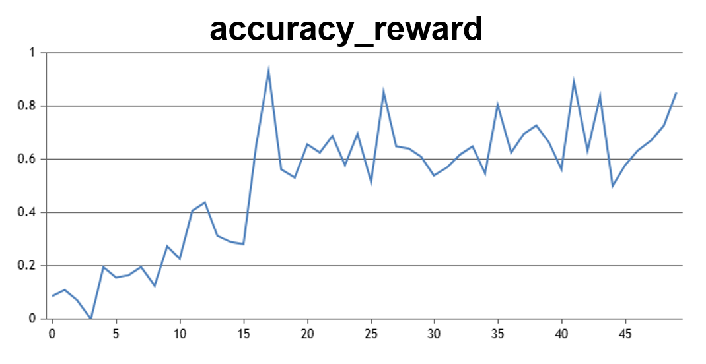

# 基于TRL与open-r1在NPU上实现Qwen3-8B GRPO

本文介绍如何在NPU上基于TRL和open-r1项目进行Qwen3-8B GRPO训练。

## 环境配置

### 支持的设备
- Atlas A2 训练系列 (Atlas 800T A2, Atlas 900 A2 PoDc)

### 环境依赖
| 依赖        | 推荐版本                                                                                                     |
|-----------|----------------------------------------------------------------------------------------------------------|
| Python    | [3.10](https://www.python.org/downloads/)                                                                |
| CANN      | 在研版本*   |
| NNAL      | 在研版本*   |
| torch-npu | 在研版本*               |
| torch     | [2.5.1](https://github.com/pytorch/pytorch/releases/tag/v2.5.1)                                          |
| torchvision     | 0.20.1                                          |
| tensordict     | 0.8.3                                          |
| numpy     | 1.26.4                                          |

* *在研版本请联系相关人员获取。

### 安装vLLM

```shell
git clone --branch v0.9.1 https://github.com/vllm-project/vllm.git
cd vllm
pip install -r requirements/build.txt
VLLM_TARGET_DEVICE=empty pip install -e .
cd ../
```

### 安装torch, torchvision, torch-npu

```shell
pip install torch==2.5.1 torch_npu==2.5.1 torchvision==0.20.1
# torch-npu在研版本请联系相关人员获取whl包手动安装
```

### 安装vllm-ascend

```shell
git clone --branch v0.9.1-dev https://github.com/vllm-project/vllm-ascend.git
cd vllm-ascend
git checkout e99d2327d669d7601d4dfe1b9575047c64c2aa3d
COMPILE_CUSTOM_KERNELS=0 python setup.py install
cd ../
```

### 安装trl

```shell
pip install trl[vllm]==0.18.0
```

### 安装open-r1

在当前目录执行以下命令：
```shell
git clone https://github.com/huggingface/open-r1.git
cd open-r1
git checkout 0e06249d1caa3c1d27a93e590929531291c9c493
# 从本项目中拷贝部分内容至本地open-rl代码仓中
cp -r ../recipes/Qwen3-8B ./recipes/Qwen3-8B
cp ../setup.py ./setup.py
pip install -e ".[dev]"
```

## 执行GRPO训练

```shell
ACCELERATE_LOG_LEVEL=info \
    accelerate launch --config_file recipes/accelerate_configs/zero3.yaml \
    src/open_r1/grpo.py --config recipes/Qwen3-8B/grpo/config_demo.yaml \
    --vllm_mode colocate
```

基于Qwen3-8B模型和MATH-lighteval数据集训练在20次迭代之后，accuracy_reward稳定到0.5以上，峰值约为0.9，相关结果图如下：



## FQA

- 若需使用本地权重或数据集，请对应修改`recipes/Qwen3-8B/grpo/config_demo.yaml`中的`model_name_or_path`参数或`dataset_name`参数。
- 当python>=3.11时，如果遇到`pydantic_core._pydantic_core.ValidationError`或者`TypeError: code() argument 13 must be str, not int`，请升级`cloudpickle==3.1.1`。
